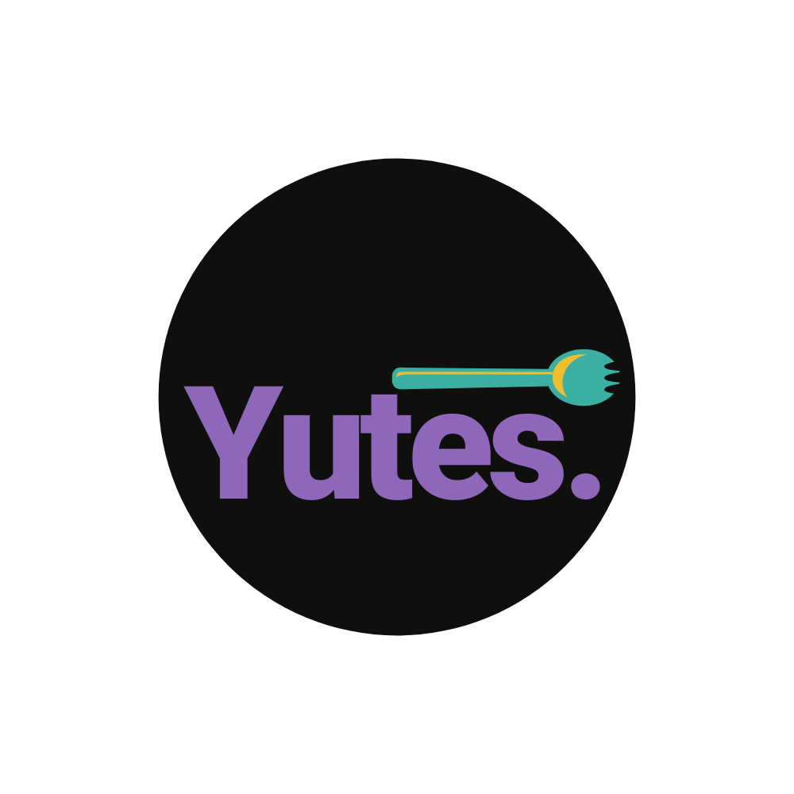

# Yutes

Yutes is a collection of bare bones scss utility (yutes) classes for basic structure & color experimentation (adjust as you code/go). 
 


I created this so I could: <br>
<ul>
  <li> 
    Get up and running fast.<br>
    <small>
      Lots of scss frameworks have too much bloat with flex-box / column styling.
    </small>
    <br>
  </li>
  <br>
  <li> 
    Let the design evolve on its own.<br>
    <small>
      Design, for me, tends to evolve with patterns that do repeat themselves, but sometimes fall outside 'norms'. Because of this, I enjoy having the ability to adjust things like breakpoints and color from a set standard, but with the ability to customize on a *per-element* or *per-selector* basis; because sometimes it's the actual utility of something that tells you what the standard should be.
    </small>
  </li>
</ul>
 
## Install

#### Terminal:
```
  npm install @riapacheco/yutes
```

#### In your main scss file:
```
  @import '~@riapacheco/yutes/yutes.scss';
```
 
## Usage:

> This was made for me to personally get up and running faster.<br> If you're just looking for basic utility scss, copy it from the files (I don't care).<br><br> E.g. take padding and margin arguments from `scss/_foundation/utilities.scss`
 
 
### Margins & Padding Syntax
Add margins and padding with syntax that's similar to all bootstrap frameworks; where the first letter defines if it's a margin or padding property, the second letter defines the direction of that property, and a dash numeric value defines how many rems (1 rem = base body text size).
```html
  <div class="pt-1 pl-1">
    This div has a padding-top of 1rem and padding-left of 1rem.
  </div>
```
 
### Container
Though I'm not messing around too much with set layout structures, the `.container` class is always helpful, since it helps you automatically center your content with decent responsive re-sizing. You can find the class in the `scss/_foundation/utilities.scss` file and can change it to whatever you like:
```scss
.container {
  width: 65%;
  margin: auto;

  @include respond-to(tablets) {
    width: 80%;
  }
  @include respond-to(smartphones) {
    width: 95%;
  }
}
```
 
### Buttons 
Life is just easier with pre-created `.btn` classes. You can find them in `scss/_user-controls/buttons.scss`; and can be used like this:
```html
  <!-- Basic button (no borders just padding)-->
  <button class="btn">
    Click!
  </button>

  <!--use .btn-sm or .btn-lg for size-->
  <button class="btn btn-sm">
    Click!
  </button>

  <!--use colors (and their variations) to add background-color-->
  <button class="btn btn-sm primary">
    Click!
  </button>
  
  <!--or-->
  <button class="btn btn-sm primary light">
    Click again!
  </button>

```
 
### Experiment with Theme Colors
The `scss/_foundation/color.scss` file contains a simple theme of 3 different colors (with 4 shades each). Though these variables do impact more feature-focused classes like `.btn`, the bottom of the file shows how they can be applied anywhere for quick styling (as you discover what you like):
```scss
.primary-color {
  color: $primary-color;
  &.light { color: $primary-light-color }
  &.medium { color: $primary-medium-color }
  &.dark { color: $primary-dark-color }

  // And background
  &.bg { color: $primary-text-color; background-color: $primary-color; }
  &.light-bg { color: $primary-text-color; background-color: $primary-light-color; }
  &.medium-bg { color: $primary-text-color; background-color: $primary-medium-color; }
  &.dark-bg { color: $primary-text-color; background-color: $primary-dark-color; }
}
```
<br>
An example of using this would be 

```html
  <div class="primary-color">
    This div's TEXT will be primary
  </div>

  <div class="primary-color bg">
    This div's BACKGROUND will be primary, with the color's text color.
  </div>
```

<br><br>

### Experiment with Breakpoints
Add media queries to specific classes as you go:
```scss
.some-element {
  width: 300px;
  margin: auto;

  @include respond-to(smartphones) {
    width: 100%;
  }
}
```
<br><br>

Based on your own style, change breakpoints in `scss/_foundation/utilities.scss`
Go to `scss/_foundation/utilities.scss` to change the three different breakpoints:
```scss
$break-small: 370px;
$break-medium: 920px;
$break-large: 1024px;
```
<br><br><br>


## Basic Schema
All styles are contained with the file having its associated name. 
i.e. All typography (including the base HTML body size) will be in `scss/_foundation/typography.scss`, since it's pulled as a variable into the main scss file with the sass decoration `@import`.

<br>

### Notes for usage
If certain scss styles aren't being picked up, you can import the files directly into your local scss file. For example, if you want to import a color variable:
<br>
<code>
  @import '~@riapacheco/yutes/_foundation/colors.scss';
</code>
<br><br>

#### Recommendation: SASS's `@use` decorator
Jussayin: to keep things tidy, so that you know where things come from when reading the code (or someone else is reading your code), I suggest using SASS's `@use` decorator over the (soon to be deprecated) `@import`. This is because it creates a <strong>namespace</strong> for easier origin tracing. E.g:<br><br>
`src/components/some-component.scss`:

```scss
@use `~@riapacheco/yutes/_foundation/colors.scss' as _color;

.some-element {
  background-color: _color.$primary-color;
}
```
 
## The `alt-colors.scss` and `themes.scss` files: Just an FYI
These are experimental files, where you can add custom alternative colors and apply them as a theme later with your own actual programming logic. The idea is that when a class (at the top of each component) is changed to a different boolean outcome (e.g. `isDarkTheme = true`), you can add `.dark-theme` globally to apply an alternative dark-theme style.
 
Again, this was meant for the 'discover as you go' model; whereby I tend to design components one-by-one. One component might look similar to another, but might require a different interpretation of a 'dark' version. 
 
To change it up, the `.dark-theme` class is found at the bottom of `yutes.scss`.

 

### If you're curious about this:
Using Angular, I'm creating a light and dark version of each component as I create them. Their different versions can be turned on or off using the `[ngClass]` directive. <br><br>
Later, when the app is more complete, I pull out the directives' input properties (that decide this default state) and put them into a global service. This way, the whole app can have a dark-mode switched on all at once, but with a thoughtful design that wasn't a half-assed "black versus white".<br><br>
HTML:
```html
  <!--A component's super div-->
  <div [ngClass]="isDarkMode ? 'dark-theme' : 'some-normal-class'">
    Where the component goes
  </div>
```
 
TS:

```typescript
  export class SomeComponent implements OnInit {
    isDarkMode = false;
  }
```
 
## Flexbox (mostly) not included
Since I usually work with packages like `@angular/flex-box` from `@angular/cdk`, I did not include flex boxes that much in here. 
